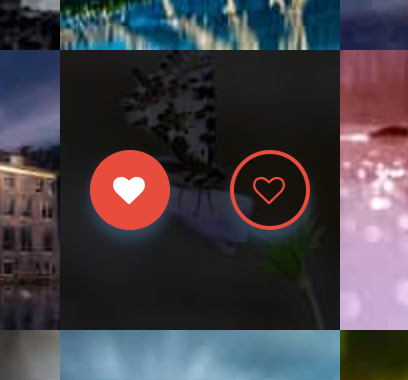

# [Photography](https://photograph.michaelfich.com/)

## Description

This app features a main page which prompts the user to login via their 500px account.  Once successfully logged in, using OAuth 1.0 to authorize a user using their [500px](https://www.500px.com) account, the user is able to view the gallery of the top 100 most popular photographs featured on that platform.  While viewing the gallery of popular photographs, the user can move their mouse over a photo to see two buttons which appear.  One will allow the user to cast their vote (or 'favorite') a photograph if they like it.  The second will allow them to unfavorite the photograph.

## Usage

1. Start the application using `rails server`
2. Visit http://localhost:3000/
3. Click on the **Sign in with 500px** button on the home page
4. Authorize the application with your [500px](https://www.500px.com/) account.
5. You will be redirected to the photo gallery page (`/photos`)
6. To favorite, or unfavorite, any photograph you can move your cursor over the photo and click the left icon to favorite, and right icon to unfavorite.  See picture below for example of favorite/unfavorite icons.

## Testing

* The application has configured to run tests on TravisCI
* All tests are written in RSpec
* TravisCI will also require the code to pass [Rubocop](https://github.com/bbatsov/rubocop) linting for a successful build
